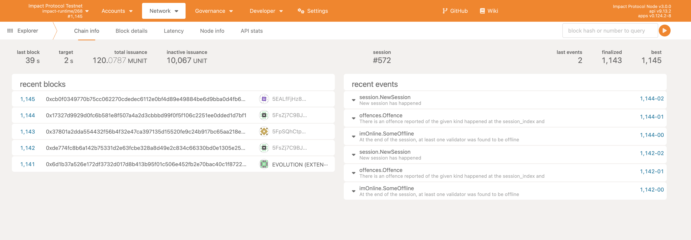
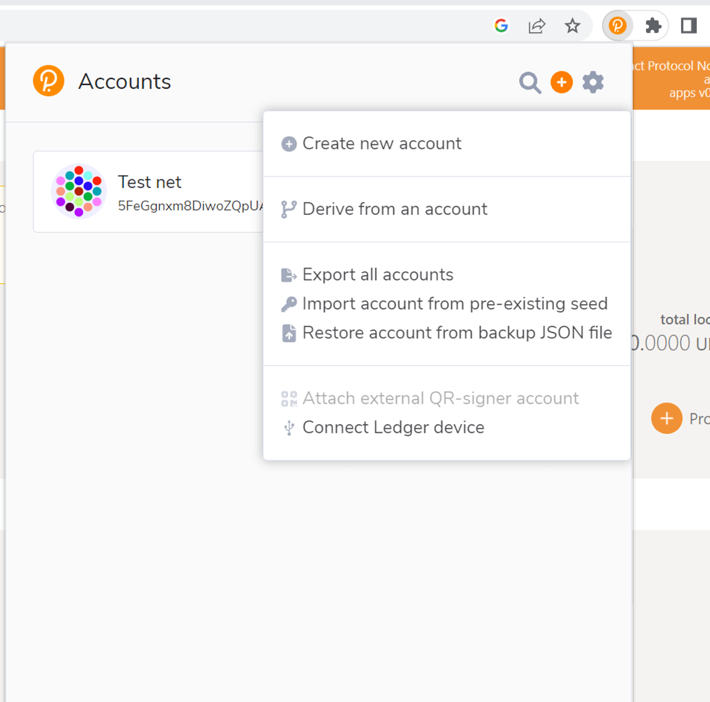

## Install Instructions

### If on Linux or Mac:

1. follow instructions 1-10 from link below:
[https://docs.substrate.io/install/linux/](https://docs.substrate.io/install/linux/)

### If on Windows

1. follow these steps:
[https://www.omgubuntu.co.uk/how-to-install-wsl2-on-windows-10](https://www.omgubuntu.co.uk/how-to-install-wsl2-on-windows-10)
Make sure WSL2 is running:

    ```bash
    wsl -l -v
    ```
    
2. run the next commands inside the VM:

    ```bash
    sudo apt-get update
    sudo apt install --assume-yes git clang curl libssl-dev llvm libudev-dev make protobuf-compiler
    sudo apt install build-essential
    curl --proto '=https' --tlsv1.2 -sSf https://sh.rustup.rs | sh
    source $HOME/.cargo/env
    rustc --version
    rustup default stable
    rustup update
    rustup update nightly
    rustup target add wasm32-unknown-unknown --toolchain nightly
    rustup showrustup +nightly show
    ```

### Next steps for Linux & Windows

1. Clone the repository:

    ```bash
    git clone https://github.com/GlobalBoost/impactprotocol
    ```
    
2. Change to the `impactprotocol` directory:

    ```bash
    cd impactprotocol
    ```
    
3. Build the project:

    ```bash
    cargo build --release
    ```

     This will take some time to build the binary depending upon your system configuration.


4. Once the build is done in the above step, run the below command to generate the mining key

    ```bash
    ./target/release/impact generate-mining-key --chain=impact-testnet
    ```
    
5. Import your mining key. Replace your seed which you generated above:

    ```bash
   ./target/release/impact import-mining-key <replace_your_seed_phrase> \--base-path /tmp/impactnode \--chain=impact-testnet
    ```

6. Then put your public key you generated before in the command below as author

    ```bash
    ./target/release/impact \
    --base-path /tmp/impactnode \
    --chain=impact-testnet \
    --port 30333 \
    --ws-port 9945 \
    --rpc-port 9933 \
    --telemetry-url "wss://telemetry.polkadot.io/submit/ 0" \
    --validator \
    --author public key here \
    --rpc-methods Unsafe \
    --name ImpactNode \
    --password-interactive
    ```

    This will ask for a keystore password, enter any random password

7. Now you should begin to mine. You are running an Impact Protocol test net node, please check in the console and you will be seeing the blocks getting finalized

8. You can check your node running by going into the link below

    [Polkadotjs](https://polkadot.js.org/apps/?rpc=ws%3A%2F%2F127.0.0.1%3A9945#/explorer). If you dont see anything loading check your port address in this case it is ```9945```, you may have some other port configured, check and replace accordingly.
   
    You should see something like shown below
    

9. Now you need to install an extension: https://polkadot.js.org/extension on Google Chrome or  Firefox. Import account with pre-existing seed that you generated in step 4. Enter your public key and set a password. Its shown below

    


