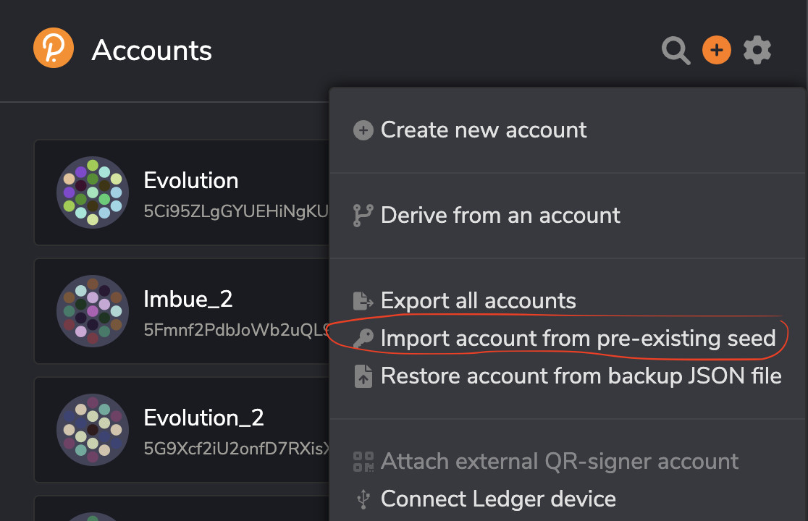
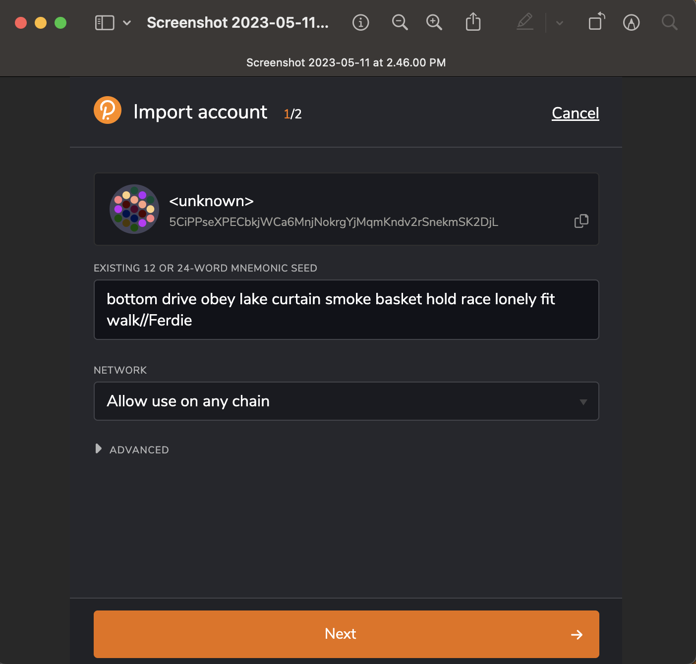
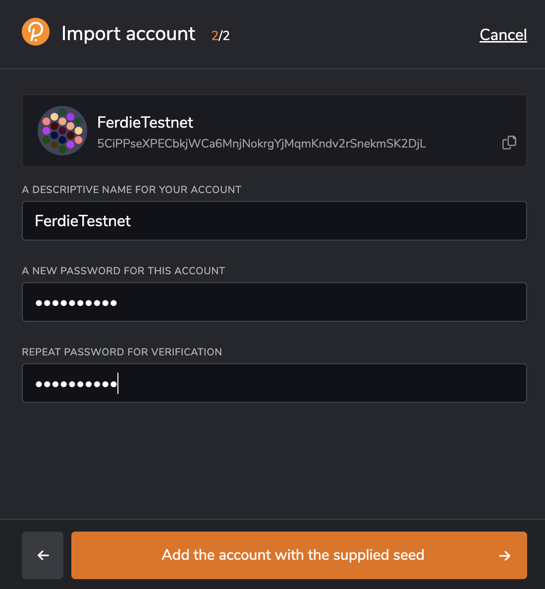
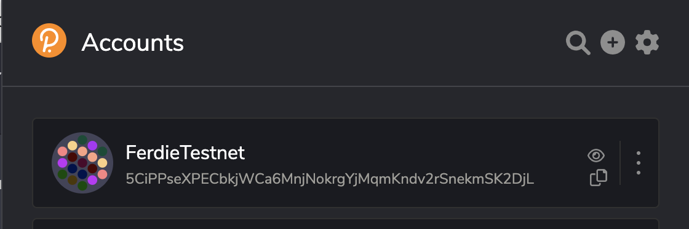
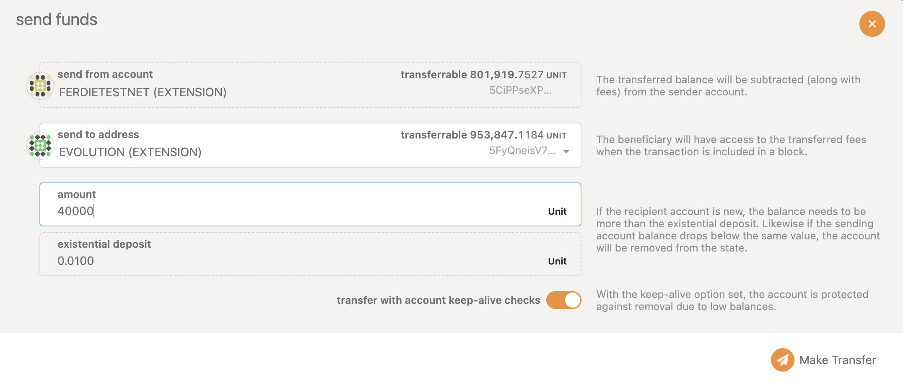
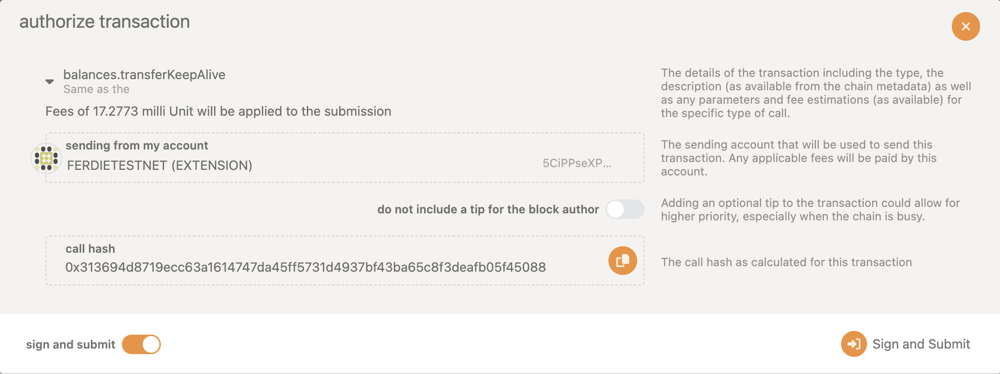
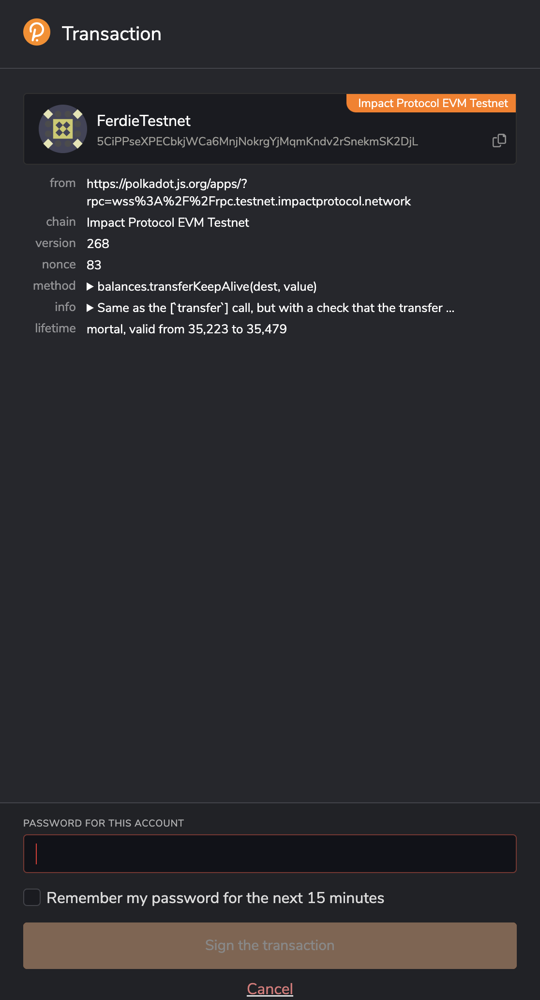
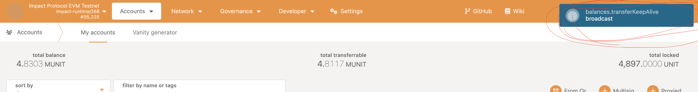
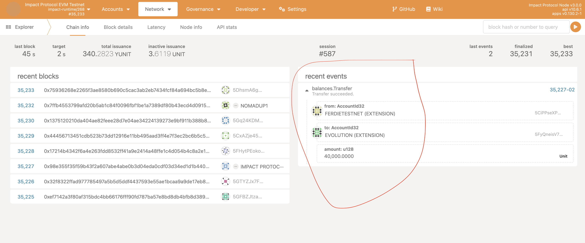

# Importing Ferdie to fund your wallet using Testnet tokens using Polkadot.js

To import a wallet into Polkadot.js using a seed phrase, you can follow these steps:

1. Open the Polkadot.js web interface in your browser and click on the "Add" icon in the top right corner and click ```import account from pre-existing seed``` as shown below
   <br/><br/>
   
    <br/><br/>
2. Enter the Ferdie 12 or 24-word seed phrase in the "Mnemonic" field as shown below
   <br/><br/>
   
    <br/><br/>
3. Enter a name for your account and select a password as shown below. The password will be used to encrypt your private key and protect it from unauthorized access.
    <br/><br/>
   
    <br/><br/>
4. Click add and you will see the account Ferdie added in the wallet list
    <br/><br/>
   
    <br/><br/>
5. Now you can transfer the testnet tokens from Ferdie to your wallet. Go to accounts, locate Ferdie and Click on the ```Send``` button. You will see the popup as shown below
    <br/><br/>
   
    <br/><br/> 
6. Enter the address of the account you want to send funds to in the "To" field and the amount you want to send in the "Amount" field and click on the ```Make Transfer``` button and you will see the authorization popup as shown below
    <br/><br/>
   
    <br/><br/>
7.  Click the ```Sign and Submit``` button to authorize the transaction. You will see the popup as shown below for entering the password(Use the same password you used while adding Ferdie account to your wallet)
    <br/><br/>
   
    <br/><br/>
8.  Enter the pass word and click the ```Sign the transaction``` button. You can see the notifcation of the transaction as shown below 
    <br/><br/>
   
    <br/><br/>
9.  Once the transaction is confirmed, you will see the notification in green color which you can verify in the explorer as shown below. 
    <br/><br/>
   
    <br/><br/>
10. Once confirmed, you will see the updated balance in your wallet.


## NOTE
#### Do not use the Ferdie account for any other purpose than funding your wallet. The Ferdie account is only for funding your wallet and should not be used for valdating or nominating.

