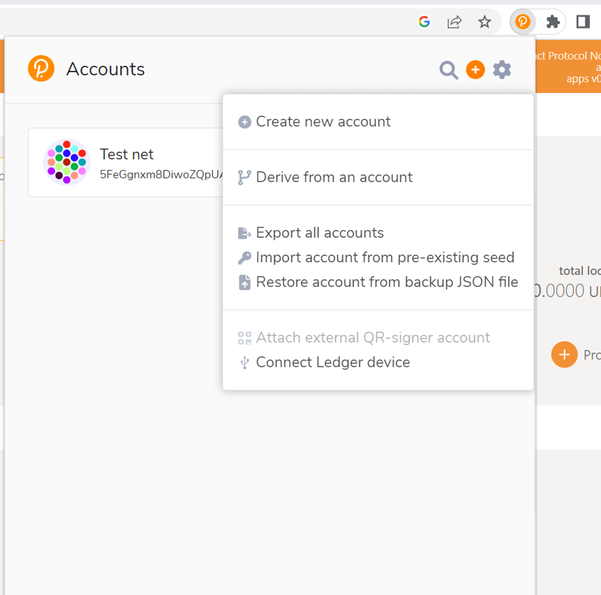

# Running as a validator

[signal_testnet_group]: https://signal.group/#CjQKICa9F2r95FQoGhYjc02lwNgKZCOfDEZngfoWgr_ZkHc4EhAOywghKv4DebEkPsicSCFb
[polkadot_explorer]: https://polkadot.js.org/apps/?rpc=ws%3A%2F%2F127.0.0.1%3A9945#/explorer

## Setup for the validator

1. Running the node - this we have already done in the installation step and have an account created with the existing seed
2. Make sure to generate the keys that is needed while running as validator, follow the step below to generate the keys, go to bash or any shell and run the command below
    ```bash
    curl -H "Content-Type: application/json" -d'{"id":1, "jsonrpc":"2.0", "method": "author_rotateKeys", "params":[ ]}' http://localhost:9933
    ```
    Copy the keys from the output of the above command and save it.
   
3. Get the minimum required stake of tokens for testnet please request here [Testnet_Group][signal_testnet_group]

4. Create another account as the controller account to manage the stash account. Go to the polkadotjs chrome extension and make create account, and make sure you save the seed phrase in a secure place. Fund the controller account as well using the above group
   
     

5. Head over to the [polkadot explorer][polkadot_explorer] and click the staking button under the Network tab as shown below
   
   

6. Once in staking go to accounts and you will see the nominator and validator button as shown below, first lets discuss about validator
    

7. Click on the validator and select the account which you want to be stash and controller account as shown in the picture below
   
   

8. Now click next, enter the keys you generated in step 2 above. You can select whether you want to be nominated and set a commission percentage. Now click bond and validate and then submit button.
 Shown below 

  

9. Once done you should see your validator in the waiting to become as validator

    

